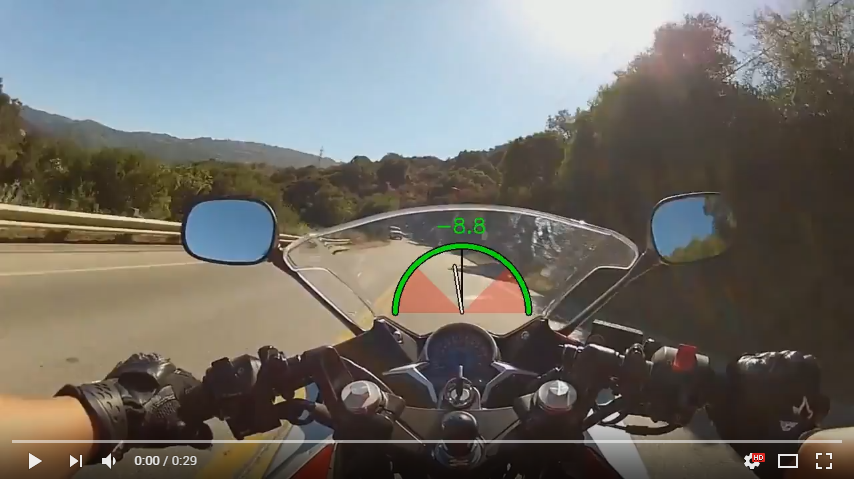
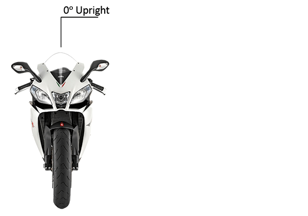
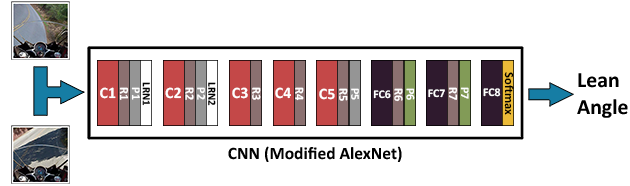

# Motorcycle Lean Assist (MLA)

This is a computer vision project using a convolutional neural network to detect the lean angle of a motorcycle through image classification.

[](https://www.youtube.com/watch?v=DP6ssxYdzqM)


## Overview
MLA is designed for novice to intermediate riders, riders who are still learning to lean or who aren't fully confident in their leaning abilities yet.

MLA believes that riders should become comfortable with a range between at least -45ᵒ and 45ᵒ to ride safely. As such, it is designed to inform the rider of this range.




# Getting Started

To run this project you'll need Caffe and OpenCV installed. You'll also need to download my trained model.

```shell
cd model/snapshots/classifier
./download_model.sh
```

Checksums:

```
aws_class_mcaug_model_iter_9000.caffemodel
MD5: 378add6aa1d0b59956a129449d05ebf5
SHA-1: e8289b9b654ce25ac0390bba4479d002a83858e3

aws_class_mcaug_model_iter_9000.solverstate
MD5: 9ee768209ce542aa34e7e5486431839f
SHA-1: bc95fde63a084518ac6cb4a7a92ff064e84e3892
```

Run the demo:

```python
python render.py example.mp4
```

There are also some example files from my dataset you can see in ```/input/train``` and ```/input/test```.


## Technical Explanation

MLA was achieved through the use of Caffe and OpenCV. I approached this as an image classification problem and achieved the desired results by retraining [Caffe's AlexNet](https://github.com/BVLC/caffe/tree/master/models/bvlc_reference_caffenet) neural network's last three fully-connected layers and retargeted them for 91 labels (one for each degree between -45ᵒ and 45ᵒ).



Since there were no readily available datasets, I synthetically created one from Google Street View images by writing automation scripts for Adobe Photoshop. I automated the rotation, crop, and overlay augmentation to generate over 100,000 images for training.


Several different models were attempted for the CNN, including trying this as a regression instead of a classification. Unfortunately those efforts did not yield better results. At the end, what helped the most was applying an inverse weighted moving average to the video stream. This brought the classifications to the desired accuracy and responsiveness as seen in the YouTube video linked above.
